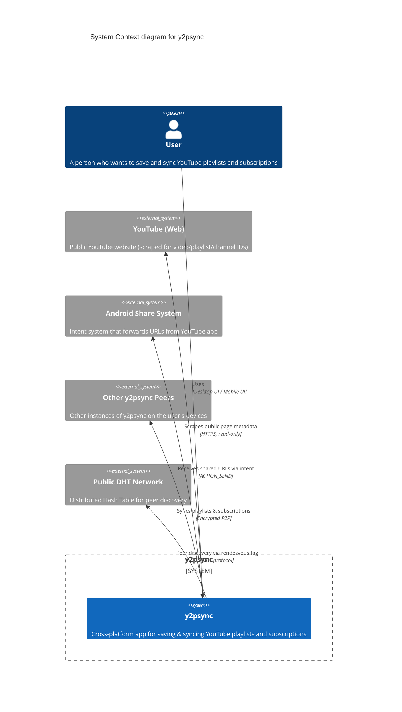
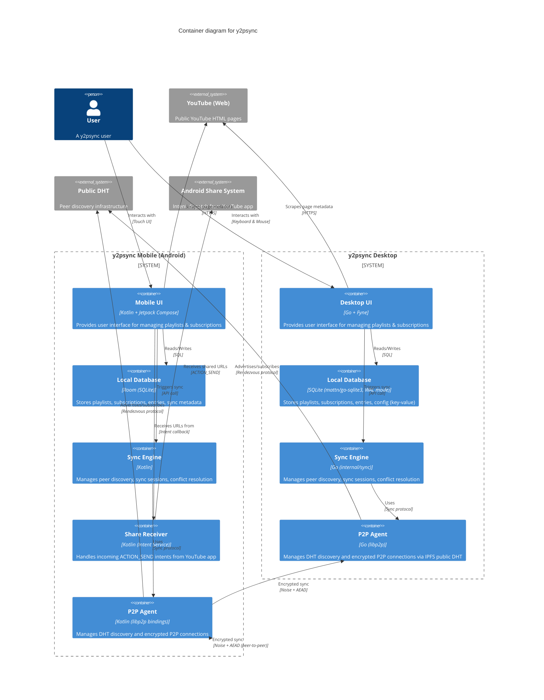
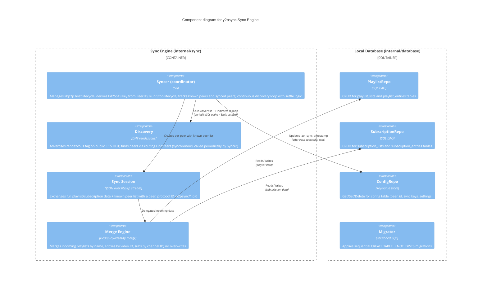
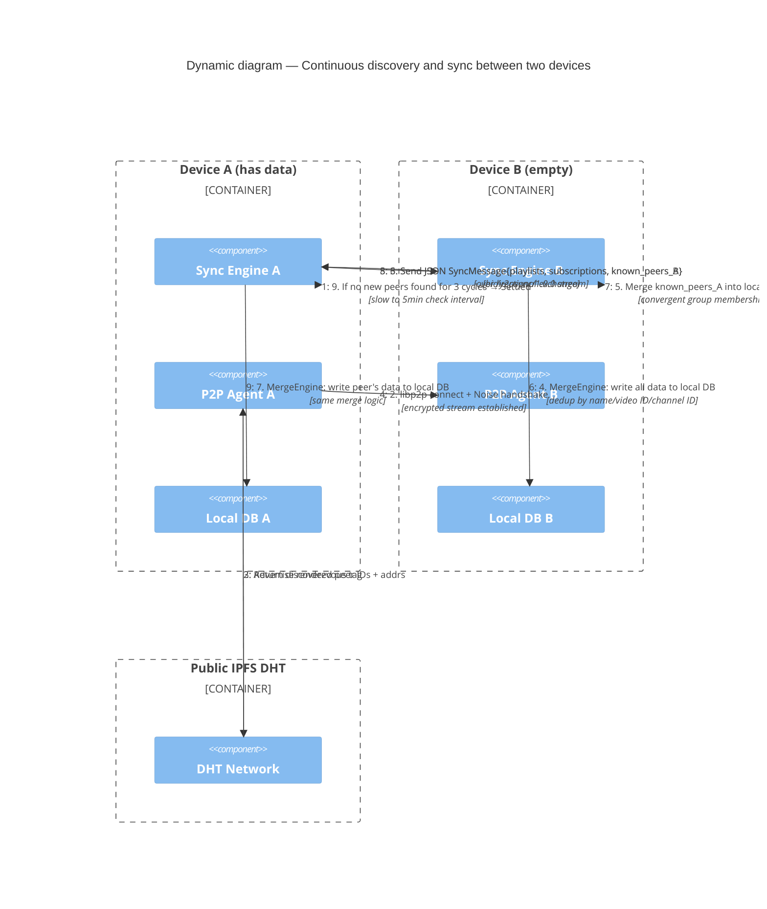
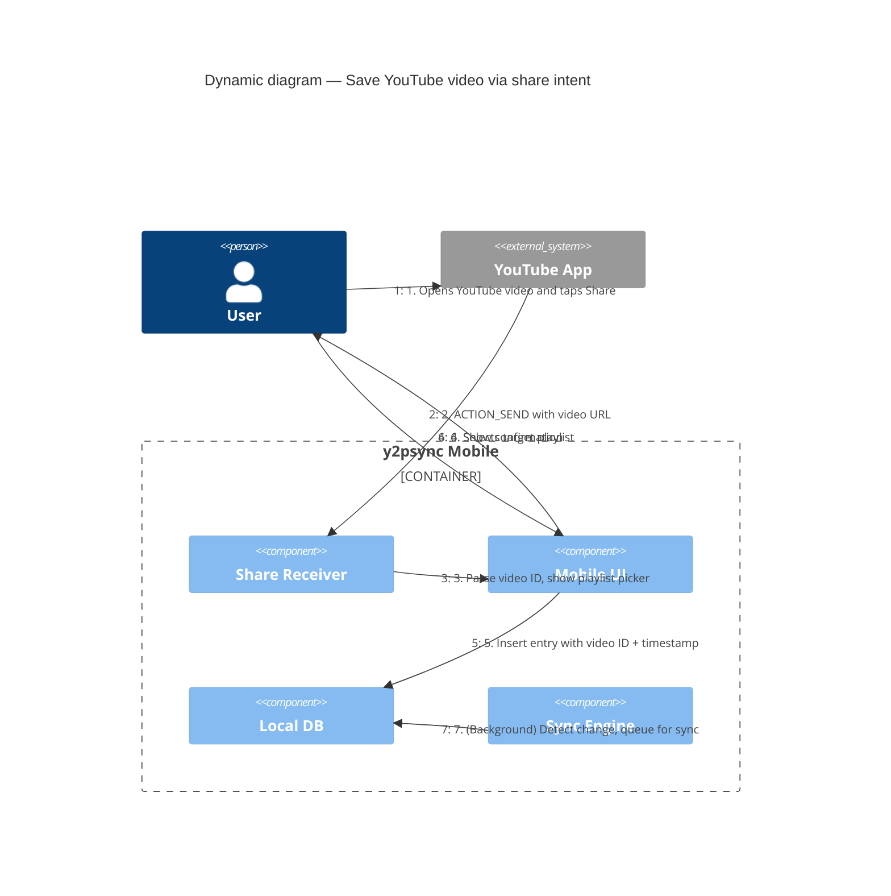
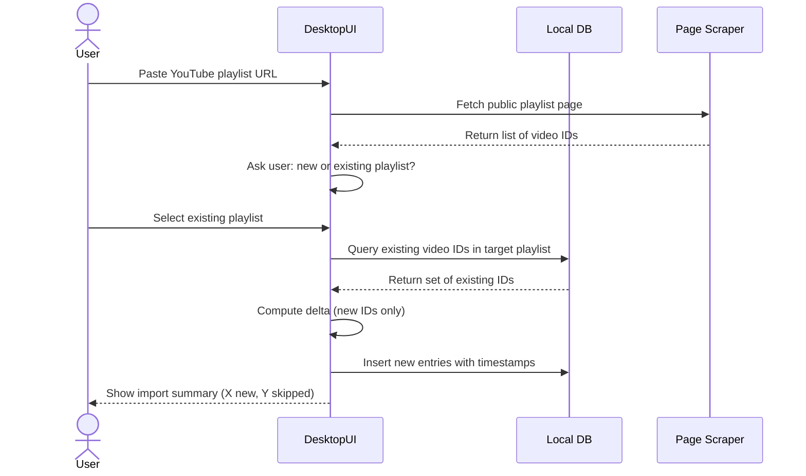
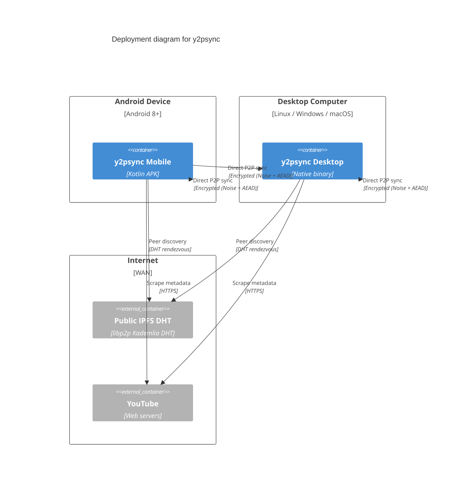

# Software Architecture Document — y2psync

**Version:** 1.2  
**Date:** 2026-07-04  
**Status:** Implemented (Desktop only)

---

## Table of Contents

1. [Introduction and Goals](#1-introduction-and-goals)
2. [Constraints](#2-constraints)
3. [Context and Scope](#3-context-and-scope)
4. [Solution Strategy](#4-solution-strategy)
5. [Building Block View](#5-building-block-view)
6. [Runtime View](#6-runtime-view)
7. [Deployment View](#7-deployment-view)
8. [Crosscutting Concepts](#8-crosscutting-concepts)
9. [Architectural Decisions](#9-architectural-decisions)
    - [ADR-001: Two Separate Identities](#901-adr-001-two-separate-identities-peer-id-vs-sync-group-key)
    - [ADR-002: Timestamp-Based Conflict Resolution](#902-adr-002-timestamp-based-conflict-resolution-not-crdt)
    - [ADR-003: No YouTube API Dependency](#903-adr-003-no-youtube-api-dependency)
    - [ADR-004: P2P without central server](#904-adr-004-p2p-without-central-server)
    - [ADR-005: JSON for Sync Serialization](#905-adr-005-json-for-sync-serialization)
    - [ADR-006: Zig Build System with Hybrid CC Strategy](#906-adr-006-zig-build-system-with-hybrid-cc-strategy)
10. [Quality Requirements](#10-quality-requirements)
11. [Risks and Technical Debt](#11-risks-and-technical-debt)
12. [Glossary](#12-glossary)

---

## 1. Introduction and Goals

### 1.1 Requirements Overview

y2psync is a cross-platform application that enables users to save, organise, and synchronise YouTube playlists and channel subscriptions across their personal devices without any centralised server, user account, or dependency on YouTube APIs.

**Core features:**
- Create and manage named YouTube playlist collections
- Create and manage named YouTube channel subscription collections
- Add YouTube videos to playlists by URL (manual entry on desktop, via Android share intent on mobile)
- Import complete YouTube playlists by URL (delta-merge, no duplicates, no overwrites)
- Add YouTube channels to subscription lists by URL (via share intent or manual entry)
- Decentralised peer-to-peer sync across user's devices using a passphrase-based Master Sync Key
- Full offline operation with sync when connectivity is available
- Timestamp-based conflict resolution per entry

### 1.2 Quality Goals

| Priority | Goal | Description |
|----------|------|-------------|
| 1 | **Privacy** | No central server, no account, no YouTube API calls. Peer identity cannot be de-anonymised. All data encrypted in transit. |
| 2 | **Offline First** | All operations succeed locally without network. Sync is opportunistic and non-blocking. |
| 3 | **Data Integrity** | No data loss on sync. Timestamp-based conflict resolution ensures convergence. No duplicate entries ever created. |
| 4 | **Cross-Platform** | Mobile (Android) and desktop (Linux/Windows/macOS) share identical data model and sync protocol. |
| 5 | **Ease of Use** | Sync setup is a single passphrase. No server configuration, no account registration, no API keys. |

### 1.3 Stakeholders

| Stakeholder | Expectations |
|-------------|--------------|
| End User (Privacy-Conscious) | No tracking, no account required, full control over data |
| End User (YouTube Power User) | Save and organise playlists/subscriptions across multiple devices |
| Developer/Implementer | Clear specification, well-defined data model and sync protocol |
| Future iOS Port Team | Architecture supports adding iOS client without protocol changes |

---

## 2. Constraints

### 2.1 Technical Constraints

| Constraint | Rationale |
|------------|-----------|
| No YouTube API usage (neither OAuth nor Data API v3) | User privacy; no dependency on Google; app works without internet to Google |
| No central server | User privacy; no operational cost; no single point of failure |
| No user account system | Privacy; no email, no password (beyond local passphrase), no identity provider |
| Must work fully offline | Users may have limited connectivity; sync is only needed occasionally |
| Android minimum API 26 | Reasonable modern baseline; covers ~95% of active Android devices |
| Desktop targets: Linux, Windows, macOS | Cross-platform Qt/Go/Tauri/etc. must support all three |

### 2.2 Organisational Constraints

| Constraint | Rationale |
|------------|-----------|
| Mobile app in Kotlin | Android ecosystem standard; interoperates with Android share intents |
| Desktop app language free choice | Performance and developer preference; must implement same data model and sync protocol |
| Open source preferred | Community trust for privacy-focused application |

### 2.3 Conventions

- All timestamps in UTC, nanosecond precision where available, millisecond minimum
- All identifiers: local UUID v4 for internal IDs, YouTube's native IDs (video, playlist, channel) for external references
- All network communication encrypted with AEAD
- RFC 2119 keywords (SHALL, SHOULD, MAY) used in requirement definitions

---

## 3. Context and Scope

### 3.1 System Context

The **y2psync** system interacts with:
- **Users** (via Desktop UI and Android Mobile UI)
- **YouTube** (public web pages only, no API — read-only scraping of publicly visible metadata)
- **Other y2psync peer instances** (via P2P network)
- **Android Share Intent System** (mobile only, receive URLs from YouTube app)

#### C4 Context Diagram (Level 1)



### 3.2 Business Context

y2psync operates as a **personal data management tool** — it does not facilitate sharing or publishing content. All data belongs to the single user and remains on their devices. The app has no business model based on data collection, advertising, or user tracking.

### 3.3 Technical Context

External interfaces:
- **YouTube Web Scrape** — Outbound HTTPS GET to `youtube.com` for publicly visible page HTML. No authentication, no cookies required. Rate-limited to reasonable human-like frequency.
- **Public DHT** — Outbound connections to a public Distributed Hash Table (e.g., libp2p DHT or Mainline DHT) for peer discovery.
- **P2P Sync Connections** — Direct encrypted connections between y2psync peers, initiated after DHT discovery.
- **Android Share Intent** — Inbound `ACTION_SEND` with `text/plain` containing a YouTube URL, from any Android application (typically the official YouTube app).

---

## 4. Solution Strategy

### 4.1 Technology Decisions

| Domain | Decision | Rationale |
|--------|----------|-----------|
| Desktop platform | Go + Fyne v2.7 | Cross-platform; good P2P library ecosystem; single binary deployment |
| Local database | SQLite (mattn/go-sqlite3, WAL mode) | Ubiquitous, embedded, zero-configuration, offline-first |
| P2P networking | libp2p v0.48 (go-libp2p + go-libp2p-kad-dht) | Mature DHT implementation; NAT traversal; Noise-encrypted streams built-in |
| Encryption | Argon2id key derivation + libp2p Noise transport | Modern, audited, no hardware dependency |
| Serialization | JSON over libp2p streams | Self-describing, no code generation step, sufficient for sync payloads |
| Build system | Zig (build.zig) | Cross-compilation with bundled libc; `zig cc` as drop-in C compiler for Go CGo. Produces fully static binaries for Linux (musl) and Windows (mingw). |

### 4.2 Architecture Pattern

**Local-first with opportunistic sync.** The application follows an offline-first architecture where the local database is the single source of truth. Sync runs **automatically** in the background when a Master Sync Key is configured — no user action is required beyond initial setup.

The P2P layer uses a **full-set exchange** model: when a device syncs with a peer, it sends its full playlist and subscription data and receives the peer's full data. Each side merges what it receives using a dedup-by-identity merge (no overwrites). There is no master node or central coordinator. Incremental change logs are planned for future optimisation.

**Continuous discovery with settle logic:** The sync engine runs a periodic discovery loop (every 30 seconds by default) that advertises on and queries the public IPFS DHT using the rendezvous tag. When a peer is found, both sides exchange their full datasets plus their list of known peer IDs. Each side merges the remote peer list into its own, causing all devices in the chain to converge on a shared view of the group membership. After 3 consecutive discovery cycles with no new peers found, the engine enters a **Settled** state and reduces the check interval to 5 minutes. If a new peer appears, it immediately returns to active discovery.

### 4.3 Identity Architecture

Two separate identity concepts are maintained to satisfy the contradictory requirements of "identify devices via passphrase" and "anonymous, unlinkable, non-colliding P2P identity":

1. **Peer ID** — 256-bit random value generated locally, never derived from the passphrase. Used on the P2P network as the device's address. Cannot be linked to the Master Sync Key.
2. **Sync Group Key** — Derived from the Master Sync Key via Argon2id. Used to authenticate group membership and encrypt sync data.
3. **Rendezvous Tag** — Derived from the Master Sync Key via a one-way hash (different derivation path from Sync Group Key). Used for DHT peer discovery.

---

## 5. Building Block View

### 5.1 Container Diagram (Level 2)



### 5.2 Component Diagram (Level 3) — Sync Engine



### 5.3 Data Model (Entity Relationship)

```
PlaylistList
  - id: UUID (PK)
  - name: string
  - created_at: timestamp (UTC)

PlaylistEntry
  - id: UUID (PK)
  - playlist_list_id: UUID (FK → PlaylistList.id)
  - youtube_video_id: string (YouTube's stable video ID)
  - display_title: string (optional, from page scrape)
  - created_at: timestamp (UTC)  ← birth timestamp per entry
  - sort_order: integer
  - is_deleted: boolean (tombstone)
  - deleted_at: timestamp (nullable)

SubscriptionList
  - id: UUID (PK)
  - name: string
  - created_at: timestamp (UTC)

SubscriptionEntry
  - id: UUID (PK)
  - subscription_list_id: UUID (FK → SubscriptionList.id)
  - youtube_channel_id: string (YouTube's stable channel ID)
  - channel_name: string (optional, from page scrape)
  - channel_url: string
  - created_at: timestamp (UTC)  ← birth timestamp per entry
  - is_deleted: boolean (tombstone)
  - deleted_at: timestamp (nullable)

Config (key-value)
  - key: string (PK)
  - value: string
  - Typical keys: peer_id, master_sync_key_salt, sync_group_key, rendezvous_tag,
    sync_key_configured, last_sync_timestamp
```

---

## 6. Runtime View

### 6.1 Scenario: Continuous Discovery and Sync

The sync engine runs continuously while the application is open (if a Master Sync Key is configured). The primary loop executes on a timer — every 30 seconds during active discovery, every 5 minutes when settled.



### 6.2 Scenario: User Saves Video to Playlist (Mobile, via Share)



### 6.3 Scenario: Delta Import of YouTube Playlist (Desktop)



---

## 7. Deployment View

### 7.1 Mobile Deployment (Android)

```
┌──────────────────────────────────────┐
│         Android Device                │
│  ┌────────────────────────────────┐  │
│  │  y2psync APK                    │  │
│  │  ┌──────────┐ ┌─────────────┐  │  │
│  │  │ App UI   │ │ Sync Engine │  │  │
│  │  └──────────┘ └─────────────┘  │  │
│  │  ┌──────────┐ ┌─────────────┐  │  │
│  │  │ P2P Agent│ │ Room DB     │  │  │
│  │  └──────────┘ └─────────────┘  │  │
│  └────────────────────────────────┘  │
│  ┌────────────────────────────────┐  │
│  │ Android OS                     │  │
│  │ - WorkManager (bg sync)        │  │
│  │ - Intent System (share rx)     │  │
│  │ - Network Stack                │  │
│  └────────────────────────────────┘  │
└──────────────────────────────────────┘
```

### 7.2 Desktop Deployment

**Build system:** Zig (`build.zig`). Run `zig build` for the host platform, or use `-Dos=linux|windows|mac` (with optional `-Darch=amd64|arm64`) for cross-compilation. Always uses `zig cc` as the C compiler. Linux builds target musl; Windows builds target mingw — both produce fully static binaries. Output goes to `build/<goos>-<goarch>/y2psync`.

```
┌──────────────────────────────────────┐
│         Desktop Machine               │
│  (Linux / Windows / macOS)           │
│  ┌────────────────────────────────┐  │
│  │  y2psync (~47MB static binary) │  │
│  │  ┌──────────┐ ┌─────────────┐  │  │
│  │  │ App UI   │ │ Sync Engine │  │  │
│  │  └──────────┘ └─────────────┘  │  │
│  │  ┌──────────┐ ┌─────────────┐  │  │
│  │  │ P2P Agent│ │ SQLite DB   │  │  │
│  │  └──────────┘ └─────────────┘  │  │
│  └────────────────────────────────┘  │
│  ┌────────────────────────────────┐  │
│  │ OS                             │  │
│  │ - X11/Wayland/OpenGL (dyn)     │  │
│  │ - Network Stack                │  │
│  │ - File System (DB file)        │  │
│  └────────────────────────────────┘  │
└──────────────────────────────────────┘
```

### 7.3 Network Topology



---

## 8. Crosscutting Concepts

### 8.1 Domain Model

The domain model is shared across all client platforms and serialised as JSON for network sync.

**Core entities (internal/model):**
- `PlaylistList` — a named collection of video entries
- `PlaylistEntry` — a single YouTube video reference (video ID + title + sort order)
- `SubscriptionList` — a named collection of channel entries
- `SubscriptionEntry` — a single YouTube channel reference (channel ID + name + URL)
- `SyncMetadata` — per-peer tracking of last sync state (stored in config table)

**Identity values:**
- `PeerID` — 256-bit random identifier, immutable for device lifetime
- `SyncGroupKey` — derived from Master Sync Key via Argon2id, used for encryption
- `RendezvousTag` — SHA-256 of `"rendezvous:" + masterKey`, used for DHT discovery

### 8.2 Persistence

- SQLite via mattn/go-sqlite3 with WAL journal mode
- Schema migrations via ordered SQL statements in `internal/database/migrations.go`
- All timestamps stored as ISO 8601 UTC (RFC3339Nano)
- Key-value config table for settings and sync metadata
- Backup via WAL checkpoint + file copy; restore opens backup read-only and re-inserts

### 8.3 Security

- **At rest:** Local database not encrypted by default (relies on device-level encryption). MAY add SQLCipher in future.
- **In transit:** All P2P traffic encrypted with Noise Protocol handshake + AEAD (ChaCha20-Poly1305)
- **Key derivation:** Argon2id for Master Sync Key → Sync Group Key
- **Identity:** Peer ID generated from CSPRNG; never derived from or linkable to passphrase
- **No secrets in code:** No hardcoded keys, tokens, or API credentials

### 8.4 Synchronisation Protocol

The sync engine runs **automatically** while the application is open (if a Master Sync Key is configured). It uses a continuous discovery loop with the following phases:

#### 8.4.1 Continuous Discovery Loop

1. **Active discovery** (default interval: 30 seconds): The engine advertises the rendezvous tag on the public IPFS DHT and calls `FindPeers`. Every discovered peer is checked against the local known-peers set. Unknown peers trigger a sync session.
2. **Settle logic:** If 3 consecutive discovery cycles find no new peers, the engine transitions to **Settled** state and reduces the check interval to 5 minutes. If a new peer appears at any point, it immediately returns to active 30-second discovery.
3. **Re-sync:** Known peers are re-synced every 5 minutes to pick up any changes made since the previous sync.

#### 8.4.2 Sync Session (Bidirectional JSON Exchange)

Each sync session uses a **full-set exchange** model over libp2p Noise-encrypted streams:

1. **Discovery:** Both peers advertise the rendezvous tag on the public IPFS DHT via `util.Advertise`. The syncer's loop periodically calls `util.FindPeers` to discover active peers.
2. **Connection:** A direct libp2p connection is established with Noise transport encryption (built into go-libp2p) and a stream is opened with protocol ID `/y2psync/1.0.0`.
3. **Exchange:** Each peer sends a JSON `SyncMessage` containing:
   - `PeerID`: The sender's application-layer Peer ID (256-bit hex)
   - `Playlists`: All playlists with entries
   - `Subscriptions`: All subscription entries
   - `KnownPeers`: List of peer IDs the sender knows about (enables convergent group membership)
   The exchange is bidirectional — both sides send and receive simultaneously.
4. **Merge:** Dedup-by-identity merge — playlists matched by name, entries by video ID, subscriptions by channel ID. No overwrites. New entries are appended with new UUIDs and current timestamps.
5. **Peer list merge:** Each side merges the remote's `KnownPeers` into its local peer set. Over time, all devices in the sync chain converge on the same view of group membership.
6. **Serialization:** JSON over a libp2p stream.
7. **Key derivation:** The libp2p host Ed25519 identity is derived from the existing Peer ID (stored in config) via `SHA-256("libp2p-ed25519" + seed)`, ensuring the libp2p identity is consistent with the application-level Peer ID.

#### 8.4.3 SyncMessage Format

```json
{
  "type": "data",
  "peer_id": "a1b2c3d4...",
  "playlists": [
    {
      "name": "Watch Later",
      "entries": [
        {"video_id": "dQw4w9WgXcQ", "title": "Rick Astley"}
      ]
    }
  ],
  "subscriptions": [
    {"channel_id": "UC...", "channel_name": "Channel Name", "channel_url": "https://..."}
  ],
  "known_peers": ["peerID1", "peerID2", "peerID3"]
}
```

#### 8.4.4 Status Model

The sync engine exposes a `SyncStatus` struct via a channel for UI updates:

| Field | Description |
|-------|-------------|
| `State` | Current status: `Idle`, `Discovering...`, `Settled`, `Error` |
| `KnownPeers` | Number of unique peer IDs discovered (from DHT or peer list exchange) |
| `SyncedPeers` | Number of peers successfully synchronised with |
| `LastSync` | RFC3339 timestamp of the most recent successful sync |

- **Idle:** Sync is not configured or not running.
- **Discovering...:** Actively searching for peers on the DHT (30s discovery interval).
- **Settled:** No new peers found recently; all known peers have been synced (5min check interval).
- **Error:** Sync encountered a fatal error (e.g., libp2p host creation failed).

### 8.5 Error Handling

- All network operations have timeouts (configurable, default 30s for sync, 10s for DHT)
- Network failures are non-fatal; changes remain queued locally
- Sync conflicts that cannot be resolved by timestamp are resolved deterministically by comparing Peer IDs lexicographically
- Database corruption detected via SQLite integrity check; user prompted to rebuild from sync

### 8.6 Logging and Debugging

- Log levels: ERROR, WARN, INFO, DEBUG
- Log destination: file in application data directory (`y2psync.log`)
- Log rotation: 3 files of 5MB each
- No personal data or User IDs written to logs
- Sync session details (peer ID, timestamp, entry count) logged at INFO level

### 8.7 Testing

- Unit tests for database operations (playlist/subscription CRUD, restore)
- Unit tests for URL parsing (video ID, channel ID extraction)
- Integration tests for restore/merge using real backup files
- Go vet enforced in CI

---

## 9. Architectural Decisions

### 9.1 ADR-001: Two Separate Identities (Peer ID vs Sync Group Key)

**Context:** The requirements demand both "identify devices via user passphrase" and "anonymous, unlinkable, non-colliding P2P identity".

**Decision:** Maintain two separate identity concepts. Peer ID is a random 256-bit value with no relation to the passphrase. Sync Group Key is derived from the passphrase via Argon2id.

**Consequences:**
- + Peer ID cannot be used to de-anonymise users
- + Peer ID collisions are practically impossible (256-bit random space)
- + Passphrase changes only change the Sync Group Key, not the Peer ID
- − Requires careful implementation to never leak the relationship between Peer ID and Sync Group Key

### 9.2 ADR-002: Timestamp-Based Conflict Resolution (Not CRDT)

**Context:** The previous specification considered CRDT-based merge. The user clarified that per-entry timestamps should determine conflict resolution.

**Decision:** Use per-entry `created_at` timestamps as the conflict resolution authority. The entry with the newer timestamp always wins. Ties broken by lexicographic Peer ID comparison.

**Consequences:**
- + Simpler than CRDT implementation
- + Deterministic convergence
- + User-intuitive ("I added it later, so I meant it")
- − Requires synchronised clocks (NTP assumed; drift accepted up to reasonable tolerance)
- − Cannot handle true concurrent edits to the same entry at the same nanosecond (extremely rare, tiebroken by Peer ID)

### 9.3 ADR-003: No YouTube API Dependency

**Context:** The user explicitly requires that y2psync NEVER touches YouTube APIs.

**Decision:** All YouTube content interaction is limited to: (a) URL parsing to extract stable IDs, (b) scraping publicly visible HTML pages for display metadata only. No API keys, no OAuth, no authenticated requests to Google.

**Consequences:**
- + Complete user privacy — no Google account needed
- + No rate limiting from API quotas
- + Application works without internet connectivity to Google
- − Page scraping is fragile; YouTube HTML changes may break metadata extraction
- − Cannot programmatically discover user's existing YouTube subscriptions (must be user-shared)

### 9.4 ADR-004: REST API / serverless P2P (no central server)

**Context:** The application must sync without any centralised server.

**Decision:** Use P2P networking with DHT-based peer discovery and direct connections. No relay servers, no STUN/TURN (except what libp2p provides internally).

**Consequences:**
- + No operational cost
- + No central point of failure or surveillance
- − NAT traversal may fail on restrictive networks (some users may need LAN sync only)
- − Both devices must be online simultaneously for sync to occur

### 9.5 ADR-005: JSON for Sync Serialization

**Context:** Cross-platform data serialization needed for sync protocol. Previously specified protobuf.

**Decision:** Use JSON for all sync payloads sent over libp2p streams. Each message is a self-describing JSON object encoded/decoded via Go's `encoding/json`.

**Consequences:**
- + No code generation step; no dependency on protoc
- + Human-readable and debuggable on the wire
- + Sufficient for the current sync payload sizes (typically < 1MB)
- − Larger wire format than protobuf (acceptable for occasional sync)
- − No schema enforcement at the serialization layer (mitigated by Go's type system)

### 9.6 ADR-006: Zig Build System with Cross-Compilation

**Context:** The Go + Fyne stack requires a C compiler for CGo (graphics stack + SQLite). Cross-compilation for Linux/Windows/macOS is desired.

**Decision:** Use Zig's `build.zig` as the build orchestrator. `zig cc` provides the C compiler for all targets (both native and cross), ensuring a consistent toolchain. The build script exposes `-Dos` (linux/windows/mac) and optional `-Darch` (amd64/arm64) options instead of raw Zig target triples.

**Consequences:**
- + `zig cc` enables cross-compilation without installing target-specific toolchains (MinGW, macOS SDK basics)
- + Linux builds target musl, Windows builds target mingw — both produce **fully static binaries** with no external libc dependency
- + Single `zig build -Dos=linux` command for any target
- − macOS binaries link Apple's system frameworks and cannot be fully static
- − Cross-compilation requires X11 development headers for Linux targets; macOS cross-compilation requires Apple's frameworks

---

## 10. Quality Requirements

### 10.1 Quality Tree

```
Quality Model for y2psync
├── Privacy (highest priority)
│   ├── No data sent to central servers
│   ├── Peer identity cannot be de-anonymised
│   ├── All sync traffic encrypted
│   └── No YouTube API calls
├── Reliability
│   ├── No data loss on sync
│   ├── Deterministic conflict resolution
│   └── Offline operation never blocks the user
├── Usability
│   ├── Sync setup = one passphrase
│   ├── Share intent works from YouTube app (mobile)
│   └── Delta import "just works" (no duplicates)
├── Performance
│   ├── Local operations are instant (< 100ms)
│   ├── Sync completes in reasonable time (< 30s for typical data)
│   └── Background sync doesn't drain battery
└── Portability
    ├── Android mobile (primary)
    ├── Desktop Linux, Windows, macOS
    └── Future: iOS
```

### 10.2 Quality Scenarios

| Scenario | Quality | Given | When | Then |
|----------|---------|-------|------|------|
| Sync convergence | Reliability | Three devices make concurrent offline changes | They sync pairwise | All three converge to identical state |
| Share intent handling | Usability | User is in YouTube app | Shares a video to y2psync | Video added to selected playlist in < 2 seconds |
| Privacy leak | Privacy | Attacker monitors P2P traffic | Collects all observed Peer IDs and payloads | Cannot link any Peer ID to a user identity or Master Sync Key |
| Offline resilience | Reliability | Device has no network | User adds 100 videos to playlists | All saved locally; sync queued; no errors |
| Delta import | Usability | Playlist has 5 entries; YouTube playlist has 5 entries with 3 overlapping | User imports YouTube playlist | Result has 7 entries (no duplicates, existing 5 preserved) |

---

## 11. Risks and Technical Debt

### 11.1 Known Risks

| Risk | Likelihood | Impact | Mitigation |
|------|-----------|--------|------------|
| YouTube page structure changes break metadata scraping | Medium | Medium | Graceful degradation; display YouTube IDs instead of titles if scrape fails |
| NAT traversal fails for some users | Medium | Medium | Support LAN-only sync via mDNS; document port forwarding needs |
| Two devices generate identical timestamps for the same entry | Low | Low | Tie-breaking by Peer ID ensures deterministic resolution |
| User forgets Master Sync Key | Medium | High | Encourage export of sync settings; consider a written backup mechanism |
| Master Sync Key is weak/guessable | Medium | High | Enforce minimum 12-character passphrase; show strength indicator; use Argon2id to slow brute-force |
| Clock drift causes unexpected conflict resolution | Low | Medium | Use NTP-adjusted UTC; sync protocol includes clock skew tolerance |

### 11.2 Technical Debt (Known)

| Item | Description | Plan |
|------|-------------|------|
| Mobile (Android/iOS) not yet implemented | Architecture supports it, but only desktop client exists | Build mobile clients using the same sync protocol |
| No incremental change log | Full dataset exchanged on every sync — inefficient for large data | Add change tracking and partial sync in future |
| No mDNS LAN discovery | Only DHT-based WAN discovery implemented; DHT may fail on restrictive NATs | Add mDNS for zero-config LAN sync |
| No background sync when app is closed | Sync only runs while the app is open | Consider a system tray daemon or background service |
| No automated recovery from database corruption | SQLite is robust but not immune | Add periodic integrity checks in future release |
| No web UI | Currently only native apps | A web client could be added using the same sync protocol |
| No export/import of data as JSON | Users may want portable backup | Add in v1.1 milestone |

---

## 12. Glossary

| Term | Definition |
|------|------------|
| **Master Sync Key** | User-chosen passphrase used to authenticate and encrypt sync between devices. Never transmitted in plaintext. |
| **Sync Group Key** | Cryptographic key derived from the Master Sync Key via Argon2id, used for group authentication and data encryption. |
| **Peer ID** | 256-bit random identifier generated on each device. Used as the device's address on the P2P network. Cannot be linked to the Master Sync Key. |
| **Rendezvous Tag** | One-way hash derived from the Master Sync Key (separate path from Sync Group Key), used for DHT peer discovery. |
| **DHT** | Distributed Hash Table — a decentralised key-value store used for peer discovery without a central server. |
| **mDNS** | Multicast DNS — a protocol for discovering devices on the local network without configuration. |
| **Tombstone** | A marker indicating that an entry has been deleted, retained to prevent resurrection during sync. Includes deletion timestamp. |
| **Delta Import** | Importing entries from an external source (YouTube URL) without overwriting existing entries or creating duplicates. |
| **Created-at Timestamp** | Per-entry UTC timestamp set when the entry is first added. Used as the authoritative value for conflict resolution during sync. |
| **Noise Protocol** | A framework for building cryptographic protocols with authenticated key exchange. Used for P2P handshake. |
| **AEAD** | Authenticated Encryption with Associated Data — encryption that provides both confidentiality and integrity. |
| **Share Intent** | Android's inter-app communication mechanism (`ACTION_SEND`) used to receive URLs from the YouTube app. |
| **PlaylistList** | A named collection of YouTube video entries created by the user within y2psync. |
| **SubscriptionList** | A named collection of YouTube channel entries created by the user within y2psync. |
| **YouTube Video ID** | The stable, unique 11-character identifier for a YouTube video (e.g., `dQw4w9WgXcQ`). |
| **YouTube Channel ID** | The stable, unique 24-character identifier for a YouTube channel (e.g., `UC_x5XG1OV2P6uZZ5FSM9Ttw`). |
| **YouTube Playlist ID** | The stable identifier for a YouTube playlist (e.g., `PLrAXtmErZgOeiKm4sgNOknGvNjby9efdf`). |
| **Argon2id** | A modern, memory-hard key derivation function resistant to GPU and ASIC attacks. |
| **ChaCha20-Poly1305** | An AEAD cipher providing encryption and authentication. |
| **libp2p** | A modular networking stack for P2P applications, providing DHT, NAT traversal, and encrypted streams. |
| **Zig** | A general-purpose programming language and toolchain. The `zig cc` subcommand provides a cross-compiling C compiler with bundled target libcs, used as the C compiler for Go CGo during cross-compilation builds of y2psync. |
| **WAL** | Write-Ahead Log — a journaling mode for SQLite that improves concurrent read performance. Used by y2psync for the local database. |

---

*This document follows the arc42 template (https://arc42.org) and uses C4 model notation (https://c4model.com) for architecture diagrams via Mermaid.*
